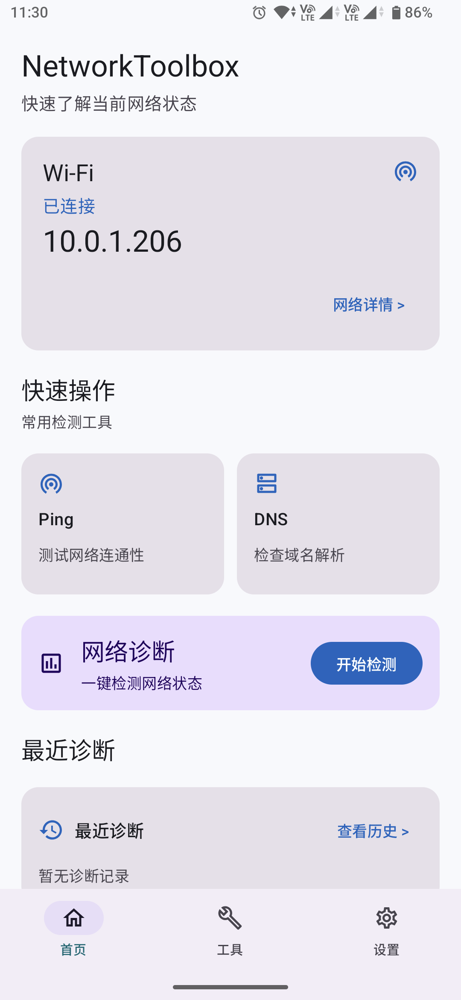
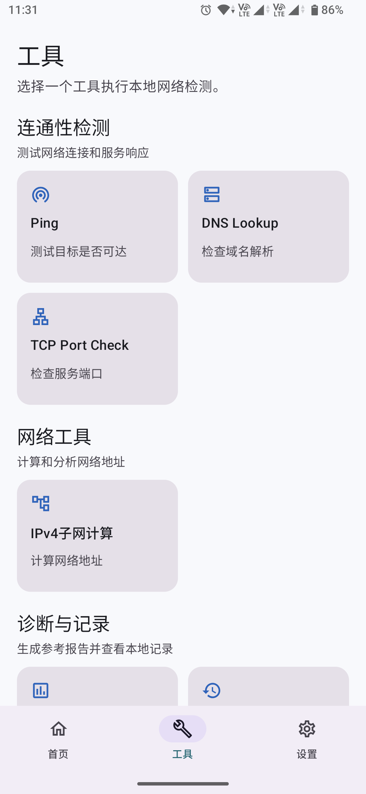
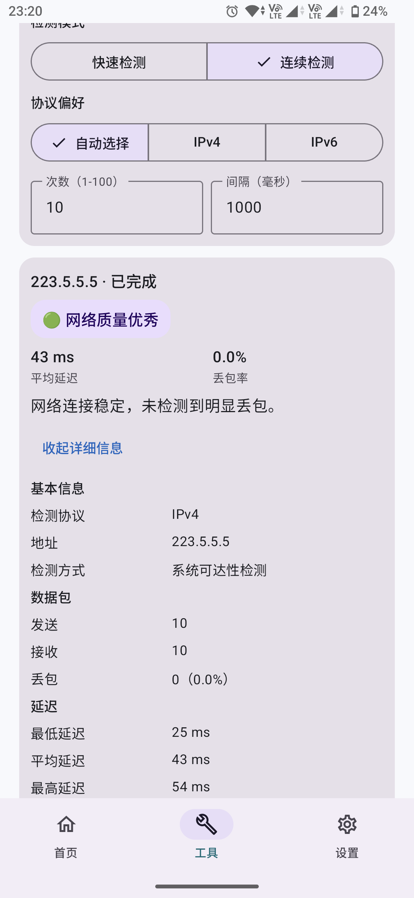
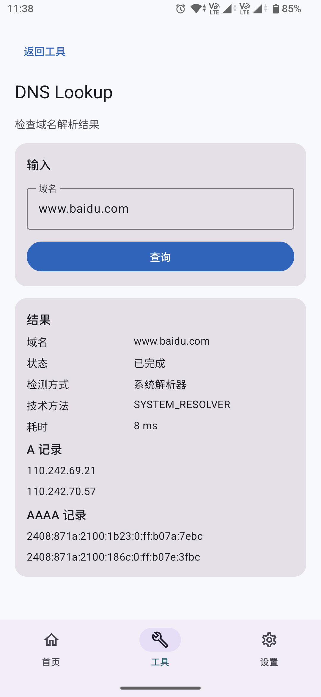
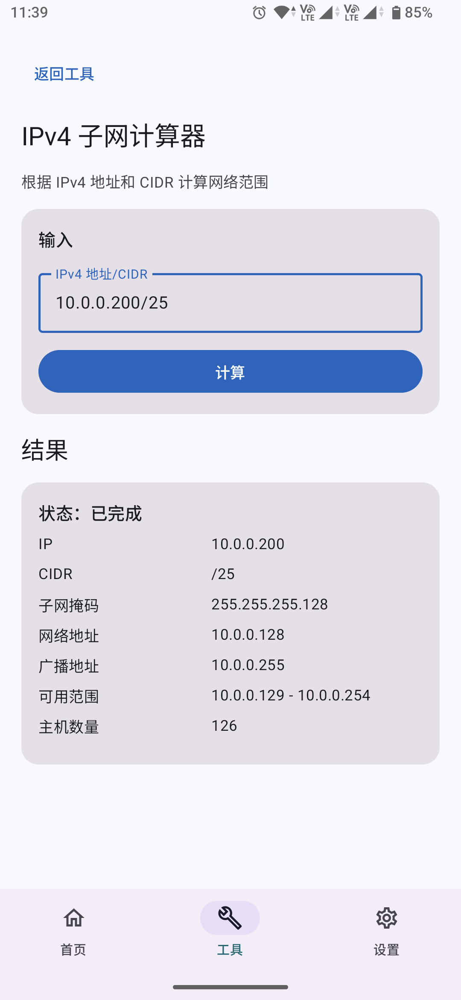
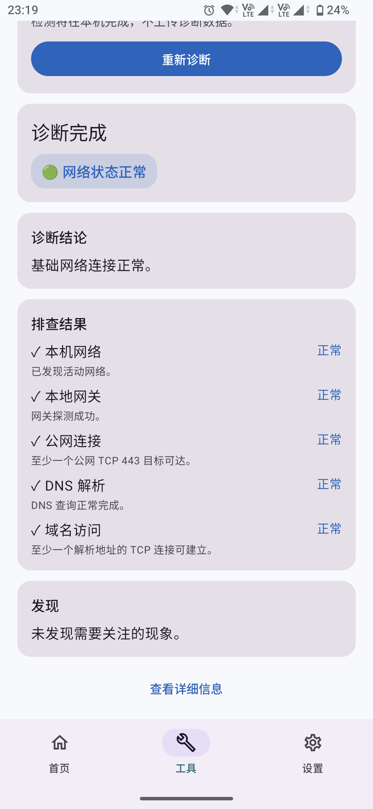

# NetworkToolbox

An open-source Android network analysis and troubleshooting toolkit.

NetworkToolbox 是一个开源 Android 网络分析与故障排查工具箱，帮助用户了解网络状态、执行针对性的本地检测，并获得排障参考。它不是自动修复工具，也不承诺自动准确诊断所有网络故障。

## Current version

- Application version: `0.3.0`
- Minimum Android version: Android 12 (API 31)
- Target Android SDK: API 36

## Core principles

- Open source
- Privacy first
- No ads
- No account required
- Local first
- Network diagnostic data is not uploaded, and app-local data does not participate in system cloud backup by default

## Features

当前已实现功能包括：

- ✅ 首页网络状态
- ✅ Ping（网络质量、连续检测与详细统计）
- ✅ DNS Lookup（A、AAAA、CNAME、MX、TXT 与 TTL）
- ✅ TCP Port Check
- ✅ IPv4 子网计算
- ✅ 网络诊断
- ✅ 本地 History
- ✅ LAN Scanner
- ✅ 自定义 IPv4 扫描范围（RFC1918，单次最多 254 个地址）
- ✅ IPv4 Traceroute
- ✅ LAN Device Identification（Reverse DNS、mDNS/Bonjour、SSDP/UPnP）

## Roadmap

以下内容仅为 Planned，不代表已承诺的发布范围：

- Wi-Fi Analyzer
- Wake-on-LAN

## Screenshots

截图目录已预留在 [`docs/screenshots/`](docs/screenshots/)。当前仓库不包含伪造或占位图片。

## Installation

Download the published APK from GitHub Releases.

Requires Android 12 or later.

The current public release is `0.3.0`.

## Privacy

- All network test results are stored locally.
- No account required.
- No network data upload.
- App-local data does not participate in Android system cloud backup by default.

NetworkToolbox 不要求账号，不上传网络诊断数据；应用本地数据默认不参与系统云备份。应用访问网络是为了执行用户主动选择的检测，不代表会上传检测数据。

## Documentation

- [Product plan](docs/PRODUCT_PLAN.md)
- [Architecture](docs/ARCHITECTURE.md)
- [Decision log](docs/DECISIONS.md)
- [Release plan](docs/RELEASE_PLAN.md)
- [Release notes](docs/releases/v0.3.0.md)
- [Development workflow](docs/DEVELOPMENT_WORKFLOW.md)
- [OSS research](docs/OSS_RESEARCH.md)

## Contributing

请先阅读 [CONTRIBUTING.md](CONTRIBUTING.md)。

## Security

安全问题请按照 [SECURITY.md](SECURITY.md) 中的说明私下报告，不要公开发布未修复的漏洞细节。

## License

NetworkToolbox 使用 [Apache License 2.0](LICENSE) 发布。
